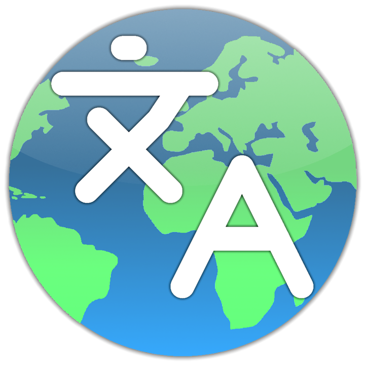

     

<h1 align="center">I18N Translator</h3>

A Universal Translator that helps you localize and translate some apps into your native language. Perfect for dev-translators localizing the app!

     <a href="https://github.com/ArsenTech/i18n-translator/issues/new?assignees=&labels=&template=bug_report.md&title=">Report bug</a>
     &nbsp;&middot;&nbsp;
     <a href="https://github.com/ArsenTech/i18n-translator/issues/new?assignees=&labels=&template=feature_request.md&title=">Request Feature</a>

![version][version-shield]
[![Contributors][contributors-shield]][contributors-url]
[![Forks][forks-shield]][forks-url]
[![Stargazers][stars-shield]][stars-url]
[![downloads][downloads-shield]][downloads-url]
[![project_license][license-shield]][license-url]
[![sponsors-badge]][sponsors-link]

[![Issues][issues-shield]][issues-url]
[![build-status][status-shield]][status-url]
![commits since latest release][commits-since-shield]
![GitHub Created At][created-at-shield]
![GitHub repo size][repo-size-shield]

  
Table of Contents

  <ol>
    <li>
      <a href="#about">About</a>
      <ul>
        <li><a href="#features">Features</a></li>
        <li><a href="#other-features">Other Features</a></li>
        <li><a href="#built-with">Built With</a></li>
        <li><a href="#download">Download</a></li>
      </ul>
    </li>
    <li><a href="#usage-manual">Usage Manual</a></li>
    <li><a href="#versioning">Versioning</a></li>
    <li><a href="#sponsors">Sponsors</a></li>
    <li>
      <a href="#contributing">Contributing</a>
      <ul>
        <li><a href="#top-contributors">Top Contributors</a></li>
      </ul>
    </li>
    <li><a href="#star-history">Star History</a></li>
    <li><a href="#license">License</a></li>
  </ol>

## About
**I18N Translator** is a desktop localization tool designed to help translators and developers create, edit, and maintain application translations in multiple file formats.

It provides a simple spreadsheet-like interface for editing translation keys while preserving the original file structure whenever possible.

Whether you are translating a small application or maintaining a large localization project, **I18N Translator** aims to provide a fast and straightforward workflow.

### Features
- 🌍 Multi-language translation editor
- 📂 Create and open translation projects
- 💾 Safe saving with format-aware serialization
- 🔍 Search and filter translation keys
- ⚠️ Missing translation filtering
- 📊 Translation progress tracking
- 📁 Recent translation history
- 🔄 Preserve XML entities and escaped characters
- 📝 JSON support
- 📝 XML Desktop support
- 📝 Android XML support
- 📝 Microsoft RESX support
- 📝 XLIFF 2.0 support
- 🎨 Modern desktop interface built with Tauri and React
- 🌐 Cross-platform support
- 📖 Glossary Support
- 🌍 I18N Support

Future releases are planned to include automatic translation tools, transliteration, spell checking, and additional localization formats.

### Planned Improvements
### v1.0.1 (Next)
- [ ] Decide whether translation keys should be sorted when saving

#### Nice to have
- [ ] Extend the Installation guide to Mac and Linux Users
- [ ] Continue writing the Troubleshooting Guide once it has new info
- [ ] Continue writing the FAQ once it has new info

#### Future Expansions
- [ ] Android XML enhancements
  - [ ] Support `translatable` attribute
  - [ ] Add "Translatable" table column
  - [ ] Preserve `translatable="false"` on save
  - [ ] Implement Translatable column settings
- [ ] The "All Glossaries" page providing Glossaries to download and use (Marketplace) + Glossary Packs (Needs Rust to update the current logic)
  > Example pack: en-hy (folder)
  > - Gaming: game.json (e.g. Skin will be "Սկին")
  > - Editing: editor.json (e.g. Track will be "Թրեք")
  > - Coding: coding.json (e.g. Bug will be "Բագ")
  > - index.json: Clean glossary full of literal 🇦🇲 words only
  > 
  > These niche-based Glossary packs will be used if I translate something.
  > 
  > Example
  > - Translating Teeworlds or Neverball -> use the gaming slang (en-hy/game.json)
  > - Translating Editors (Like OpenShot and Audacity) -> use the editor slang (en-hy/editor.json)
  > 
  > Uses the GitHub organization to store these packs (en-hy, ru-hy, etc)
- [ ] PO Language Support + Settings
- [ ] Support ICU MessageFormat & pluralization rules + Settings
- [ ] Compare difference popup
- [ ] Auto-Translation backend
  - [ ] Libre Translate API
  - [ ] Llama AI API
  - [ ] Google Translate API
  - [ ] Gemini API
- [ ] Transliteration backend
- [ ] Spell checking backend
  - [ ] Dictionary Support
  - [ ] Replace `DEFAULT_DICTIONARIES` constant with a real data
- [ ] `isDirty` changes inside new backend logic
- [ ] Settings
  - [ ] Appearance
    - [ ] High Contrast
    - [ ] Typography & Text
    - [ ] Color blindness filters
  - [ ] Clear Data
    - [ ] Clear glossary cache
  - [ ] Glossary
    - [ ] Glossary pack preferences
    - [ ] Auto-load glossary
    - [ ] Remember last glossary pack
    - [ ] Load default glossary pack
    - [ ] Apply glossary automatically during Auto-Translate
  - [ ] Spell Checker
    - [ ] Enable spell checking
    - [ ] Dictionary selection
    - [ ] Ignore words list
  - [ ] Translation
    - [ ] Transliteration provider
  - [ ] Advanced
    - [ ] Debug mode
    - [ ] Open application data directory
    - [ ] Experimental features
    - [ ] Performance settings
  - [ ] Keyboard Shortcuts
    - [ ] Customize shortcuts
  - [ ] Favorites system
    - [ ] Favorite recent translations
    - [ ] Favorite languages
    - [ ] Favorite translation providers
    - [ ] Favorite glossary entries
- [ ] Acknowledge more TODOs

### Built With
- [![Tauri][tauri-shield]][tauri-url]
- [![React][react-shield]][react-url]
- [![ShadCN UI][shadcn-shield]][shadcn-url]
- [![Tailwind CSS][tailwind-shield]][tailwind-url]
- [![Typescript][typescript-shield]][typescript-url]
- [![Vite][vite-shield]][vite-url]
- [![Rust][rust-shield]][rust-url]
### Download
You can find the latest stable version of the I18N Translator right here

[![GitHub Downloads (all assets, latest release)][download-shield]][download-url]

## Usage Manual
Full documentation is available here:
➡️ [Documentation][docs-url]
  - [Usage Guide](./docs/usage.md)
  - [Installation Guide](./docs/installation.md)
  - [Troubleshooting](./docs/troubleshooting.md)
  - [FAQs](./docs/faq.md)
  - [Translation Guide](./docs/translation.md)

## Versioning
This website follows [Semantic Versioning](https://semver.org/). You can view the full [Changelog][changelog-url] for details on each website version.

## Sponsors
Check out our awesome sponsors! ❤️
[![Sponsors List][sponsors-list]][sponsors-link]

## Contributing
Contributions are Always Welcome! Please read both [Code of Conduct][code-of-conduct-url] and [CONTRIBUTING.md][contributing-url] before contributing.
### Top Contributors
[![Top Contributors][top-contributors]][contributors-url]

## Star History
[![Star History Chart][star-history-chart]][star-history-url]

## License
This project is distributed under the Apache-2.0 License. See [`LICENSE`][license-url] for more information.

## Support And Follow
[![YouTube][yt-shield]][yt-url]
[![Patreon][patreon-shield]][patreon-url]
[![Codepen][codepen-shield]][codepen-url]
[![DeviantArt][deviantart-shield]][deviantart-url]
[![Odysee][odysee-shield]][odysee-url]
[![Scratch][scratch-shield]][scratch-url]

> GitHub [@ArsenTech][github-url] &nbsp;&middot;&nbsp;
> YouTube [@ArsenTech][yt-url] &nbsp;&middot;&nbsp;
> Patreon [ArsenTech][patreon-url] &nbsp;&middot;&nbsp;
> [ArsenTech's Website][website-url]

<!-- Markdown Links -->
[star-history-chart]: https://api.star-history.com/svg?repos=ArsenTech/i18n-translator&type=Date
[star-history-url]: https://api.star-history.com/svg?repos=ArsenTech/i18n-translator&type=Date
[contributors-shield]: https://img.shields.io/github/contributors/ArsenTech/i18n-translator.svg?style=for-the-badge&color=%2322b455
[contributors-url]: https://github.com/ArsenTech/i18n-translator/graphs/contributors
[top-contributors]: https://contrib.rocks/image?repo=ArsenTech/i18n-translator
[forks-shield]: https://img.shields.io/github/forks/ArsenTech/i18n-translator.svg?style=for-the-badge&color=%2322b455
[forks-url]: https://github.com/ArsenTech/i18n-translator/network/members
[stars-shield]: https://img.shields.io/github/stars/ArsenTech/i18n-translator.svg?style=for-the-badge&color=%2322b455
[stars-url]: https://github.com/ArsenTech/i18n-translator/stargazers
[issues-shield]: https://img.shields.io/github/issues/ArsenTech/i18n-translator.svg?style=for-the-badge
[issues-url]: https://github.com/ArsenTech/i18n-translator/issues
[license-shield]: https://img.shields.io/github/license/ArsenTech/i18n-translator?color=%2322b455&style=for-the-badge
[license-url]: https://github.com/ArsenTech/i18n-translator/blob/main/LICENSE
[version-shield]: https://img.shields.io/github/package-json/v/ArsenTech/i18n-translator?style=for-the-badge
[downloads-shield]: https://img.shields.io/github/downloads/ArsenTech/i18n-translator/total?style=for-the-badge&label=Total%20Downloads&color=%2322b455
[downloads-url]:https://github.com/ArsenTech/i18n-translator/releases
[status-shield]: https://img.shields.io/github/actions/workflow/status/ArsenTech/i18n-translator/build.yml?style=for-the-badge
[status-url]: https://github.com/ArsenTech/i18n-translator/actions/workflows/build.yml
[commits-since-shield]: https://img.shields.io/github/commits-since/ArsenTech/i18n-translator/latest?style=for-the-badge&color=%2322b455&label=Commits%20since%20latest%20version
[created-at-shield]: https://img.shields.io/github/created-at/ArsenTech/i18n-translator?style=for-the-badge
[repo-size-shield]: https://img.shields.io/github/repo-size/ArsenTech/i18n-translator?style=for-the-badge
[download-shield]: https://img.shields.io/github/downloads/ArsenTech/i18n-translator/latest/total?style=for-the-badge&label=Download&color=%2322b455
[download-url]: https://github.com/ArsenTech/i18n-translator/releases/latest
[code-of-conduct-url]: https://github.com/ArsenTech/i18n-translator/blob/main/docs/CODE_OF_CONDUCT.md
[contributing-url]: https://github.com/ArsenTech/i18n-translator/blob/main/docs/CONTRIBUTING.md
[changelog-url]: https://github.com/ArsenTech/i18n-translator/blob/main/CHANGELOG.md
[website-url]: https://arsentech.github.io
[docs-url]: https://github.com/ArsenTech/i18n-translator/blob/main/docs/README.md
[sponsors-list]: https://raw.githubusercontent.com/ArsenTech/i18n-translator/main/public/sponsors/sponsors.svg
[sponsors-link]: https://github.com/sponsors/ArsenTech
[sponsors-badge]: https://img.shields.io/static/v1?label=Sponsor&message=%E2%9D%A4&logo=GitHub&color=%23fe8e86&style=for-the-badge

<!-- Languages -->
[tauri-shield]: https://img.shields.io/badge/Tauri-FFC131?style=for-the-badge&logo=Tauri&logoColor=white
[tauri-url]: https://tauri.app/
[react-shield]: https://img.shields.io/badge/React-20232A?style=for-the-badge&logo=react&logoColor=61DAFB
[react-url]: https://react.dev/
[shadcn-shield]: https://img.shields.io/badge/shadcn%2Fui-000000?style=for-the-badge&logo=shadcnui&logoColor=white
[shadcn-url]: https://ui.shadcn.com/
[tailwind-shield]: https://img.shields.io/badge/Tailwind_CSS-38B2AC?style=for-the-badge&logo=tailwind-css&logoColor=white
[tailwind-url]: https://tailwindcss.com/
[typescript-shield]: https://img.shields.io/badge/TypeScript-007ACC?style=for-the-badge&logo=typescript&logoColor=white
[typescript-url]: https://www.typescriptlang.org/
[vite-shield]: https://img.shields.io/badge/Vite-B73BFE?style=for-the-badge&logo=vite&logoColor=FFD62E
[vite-url]: https://vite.dev/
[rust-shield]: https://img.shields.io/badge/Rust-000000?style=for-the-badge&logo=rust&logoColor=white
[rust-url]: https://rust-lang.org/

<!-- External Links -->
[yt-shield]: https://img.shields.io/badge/ArsenTech%20-222222.svg?&style=for-the-badge&logo=YouTube&logoColor=%23FF0000
[yt-url]:https://www.youtube.com/channel/UCrtH0g6NE8tW5VIEgDySYtg
[patreon-shield]:https://img.shields.io/badge/-ArsenTech-222222?style=for-the-badge&logo=patreon&logoColor=white
[patreon-url]:https://www.patreon.com/ArsenTech
[codepen-shield]: https://img.shields.io/badge/-ArsenTech-222222?style=for-the-badge&logo=codepen&logoColor=white
[codepen-url]: https://codepen.io/ArsenTech
[deviantart-shield]: https://img.shields.io/badge/-Arsen2005-222222?style=for-the-badge&logo=deviantart&logoColor=05cc46
[deviantart-url]: https://www.deviantart.com/arsen2005
[odysee-shield]: https://img.shields.io/badge/-ArsenTech-222222?style=for-the-badge&logo=odysee&logoColor=FA9626
[odysee-url]: https://odysee.com/@ArsenTech
[scratch-shield]: https://img.shields.io/badge/-ArsenTech-222222?style=for-the-badge&logo=scratch&logoColor=orange
[scratch-url]: https://scratch.mit.edu/users/ArsenTech/
[github-url]: https://github.com/ArsenTech
